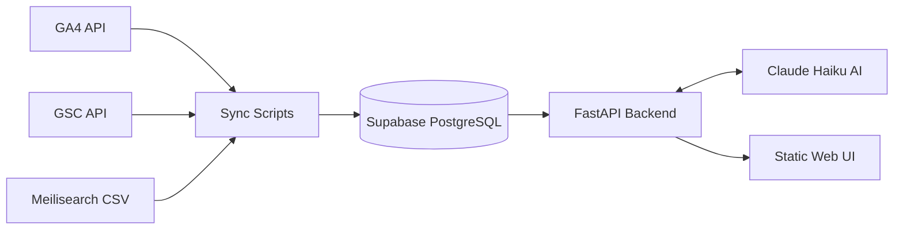

# SubjectToClimate — Data Intelligence Platform: Knowledge Transfer

**Project:** StC Data Blending V2
**Status:** Operational
**Last Updated:** May 2026

This document serves as a complete handover and knowledge transfer guide for the StC Data Blending V2 project. It is structured into two main sections tailored for both non-technical stakeholders and the engineering team taking ownership of the system.

---

## Section 1: For Non-Technical Members

### What is this project?
We built an internal Data Intelligence system that allows anyone on the team to ask plain-English questions about SubjectToClimate's website performance and get instant answers. There is no need to learn Google Analytics, Search Console, or any complex dashboard. 

### What can you ask it?
You can type a question just like you would to a colleague. For example:
- *"What were the top 5 pages by sessions last month?"*
- *"Which Google search queries drove the most clicks to our site this week?"*
- *"What are visitors searching for on our site that returns no results?"*
- *"Which countries are our visitors coming from?"*
- *"Which pages have the highest bounce rate?"*

The system understands the question, pulls the relevant data, and gives you a written summary of the answer.

### Where does the data come from?
Three sources are connected to the platform:

| Data Source | What it tells us |
|-------------|-----------------|
| **Google Analytics 4 (GA4)** | Website usage: page visits, session length, bounce rate, traffic sources. |
| **Google Search Console (GSC)** | Google search performance: what people searched for, clicks, ranking pages. |
| **Meilisearch** | On-site search behavior: top search terms, failed searches, user countries. |

**Data History:**
- **GA4:** 12 months of data
- **Google Search Console:** 16 months of data
- **Meilisearch:** 30 days of data (platform limitation — 90 days requires an enterprise plan)

### How do you use it?
1. An engineer starts the system by running a single command.
2. Open the `app/index.html` file in any web browser.
3. Type your question into the chat interface and click **Ask**.
4. Receive your data-backed answer in seconds.

### How is data updated?
A scheduled job runs every morning at 6:00 AM UTC and pulls the previous day's data from GA4 and GSC into the database. The system always stays current without manual intervention.

### Current Limitations
- **Meilisearch Analytics:** Requires a manual export from their dashboard once a month. The API does not support automated pulls on the current Meilisearch plan.
- The system answers questions about data we currently track — it cannot predict future trends or access external platforms not connected to the database.

---

## Section 2: For Technical Members

### Architecture Overview



### Tech Stack
- **Database:** Supabase (PostgreSQL)
- **Sync Scripts:** Python 3.11
- **Google Auth:** OAuth2 with refresh token (`token.json`)
- **AI Query Layer:** FastAPI + Anthropic Claude Haiku (`claude-haiku-4-5-20251001`)
- **Frontend:** Static HTML/CSS/Vanilla JS (`app/index.html`)
- **Scheduler:** GitHub Actions cron (`.github/workflows/`)

### Repository Structure
```
.
├── sync/
│   ├── sync_ga4.py              # Pulls GA4 page metrics → Supabase
│   ├── sync_gsc.py              # Pulls GSC search data → Supabase
│   └── load_meilisearch_csv.py  # Loads manually exported Meilisearch CSVs
├── server/
│   └── query_engine.py          # FastAPI app: question → SQL → answer
├── app/
│   ├── index.html               # Web UI
│   ├── style.css
│   └── app.js                   # Calls POST /ask on localhost:8001
├── db/
│   └── schema.sql               # All table definitions + execute_query RPC
├── Meilisearch-csv/             # Drop exported CSVs here before loading
├── token.json                   # OAuth2 token (gitignored)
├── oauth-credentials.json       # OAuth2 client secrets (gitignored)
└── .env                         # All credentials (gitignored)
```

### AI Query Layer — How It Works
The `server/query_engine.py` script exposes a single endpoint: `POST /ask`.
1. The endpoint receives `{ "question": "..." }`.
2. Sends the question to **Claude Haiku** with a system prompt containing the full Supabase database schema. The AI generates a PostgreSQL `SELECT` statement.
3. The server strips markdown fences and executes the SQL via Supabase's `execute_query` RPC function (read-only, SELECT only).
4. Sends the original question and the raw database rows back to Claude Haiku, which generates a plain-English response.
5. Returns `{ "answer": "...", "sql": "...", "row_count": N }` to the frontend.

### Running Locally
1. Start the API server:
   ```bash
   uvicorn server.query_engine:app --port 8001
   ```
2. Open the UI by launching `app/index.html` in your web browser.

### Authentication & Secrets
- **Google API:** Service accounts were not used. Authentication uses OAuth2 with a stored refresh token. If `token.json` is lost or revoked, run `python auth_setup.py` to re-authenticate with a Google account that has Owner access to GSC and GA4.
- **Supabase Row Level Security (RLS):** RLS must be disabled on all tables (`ga4_page_metrics`, `gsc_queries`, `gsc_pages`, `ms_top_searches`, `ms_no_results`, `ms_countries`) for the sync scripts to write via the anon key.

### Taking it Forward (Next Steps)
As I transition out of this project, here are the recommended next steps to scale and improve the system:

1. **Automate Meilisearch Syncing:**
   Once the Meilisearch plan is upgraded to Enterprise (or if the API limitations change), the manual CSV upload (`load_meilisearch_csv.py`) can be replaced with a daily cron job script, fully automating the entire data pipeline.
   
2. **Deploy the Web UI & API:**
   Currently, the application is run locally. The next phase should involve deploying the FastAPI backend to a service like Render, Railway, or AWS, and hosting the static frontend on Vercel or Netlify. This will allow the entire team to access the tool without needing a local development environment.

3. **Expand Data Sources:**
   The AI handles SQL generation based on the provided schema. By simply adding more tables to the Supabase database and updating the AI's system prompt schema, you can easily integrate data from CRMs (HubSpot/Salesforce) or marketing platforms without altering the core AI logic.

4. **Enhanced Charting & Visuals:**
   The frontend currently provides written summaries. A great addition would be hooking up a charting library (like Chart.js or Recharts) and prompting Claude to also return a JSON configuration for charts alongside the SQL, enabling visual graphs for the users.

5. **Security & Access Control:**
   Before exposing the web interface company-wide, implement basic authentication (e.g., standard login or Google SSO) on the frontend to ensure that sensitive metrics are kept secure.

---
*End of Document*
